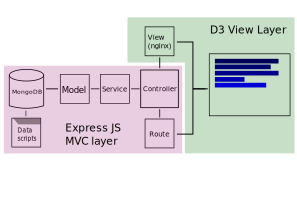
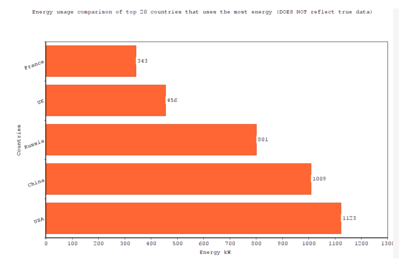
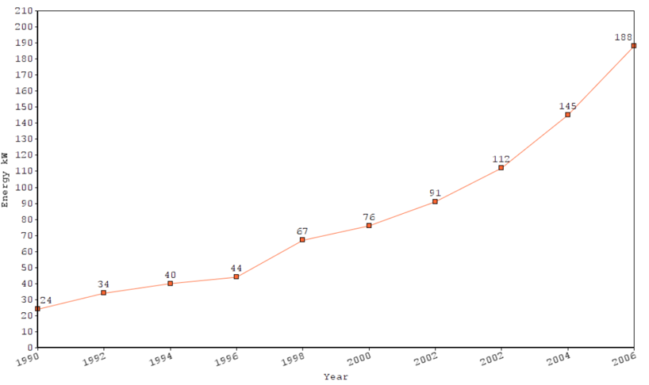
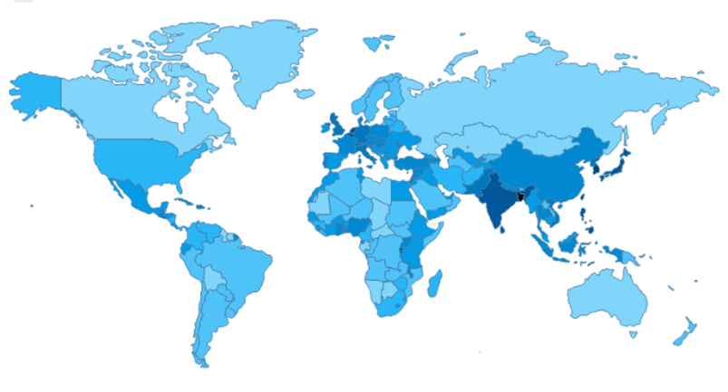

# Global-Energy-Visualization

## Introduction

Datavis group project with [Roland](https://github.com/RolandWarburton).

### Background and Motivation

The objective of this project is to show as many different energy types as possible globally,
this means collecting a wide array of data and energy usage types from different sources and
combining them to create a single data set.

This dataset will allow us to built a dynamic website using React.js, Typescript, and D3.js
to allow the user to browse with, and interact with the data sets available.

### Visualization Purpose

By the end of the project, a user will be able to compare any countries energy usage using a bar chart, compare energy usage over time through line graphs, and see data usage geographically for each 6 type of energy in any specific year.

Through the use of D3.js we hope to achieve the following "soft goals". A Soft goal is a non technical design or user experience (UI/UX).

* Gain an understanding of the trends of energy usage types of different countries using
bar graph in TWh.
* See and compare energy usage of different countries in a specific time period
* View a broad global map choropleth of any 6 energy types in any specific year or so.


## Data

The server uses [owid/energy-data](https://github.com/owid/energy-data) as a submodule dependency, be sure to run `git submodule init` and `git submodule update` to get the latest version.

There are two tables in the database that are cleaned through the use of scripting:

| datas                    | topos                   |
| ------------------------ | ----------------------- |
| energy usage data points | topographic data points |

The OWID data is in JSON format, while the topos is in topoJSON format.

OWID was chosen because of the following reasons:

The data was well formatted. The data was largely consistent and was complete where data existed.

The data was in the correct file format. A project preference was to have a data source in JSON to be
processed into BSON and stored in a document database, the format of OWID and the provided scripts
helped process the data into the correct format with minor additional work.


### Loading OWID data into the database

Loading the OWID information data can be done through `scripts/loadData.js`.

### Loading the data into the database

Loading the topojson is done through `scripts/loadTopo.js`. This imports `server/data/world-atlas.json` and its CDN source is [here](https://cdn.jsdelivr.net/npm/world-atlas@2/countries-110m.json) and its github source is [here](https://github.com/topojson/world-atlas).


### Data Processing

The data is provided by OWID in a JSON source and is converted into BSON (binary JSON).

Refer to scripts/loadData.js and scripts/loadTopo.js for more information on implementation.

Some of the challenges that were faced were handling the lack of country information in the dataset that
would be needed for working with TOPO json when creating rich map interfaces.

In other words, when it came time to injecting data into the topojson format from the OWID BSON
database, the data needed to be searchable in a reliable country code format. Using ISO-30611 was the
chosen format, we used the following packages to parse the data into a richer format that contained more
country data for topojson processing:

* country-code-lookup
* csv-parse
* i18n-iso-countries
* MongoDB

Another challenge would be that most African countries and some Asian ones doesnt have their data recorded due to obvious reasons. Hence, we had to make sure to properly format the data for the missing ones into 0 and implying that on the website.

Lastly, for the Map graph, we needed to merge both the topojson data and the energy data into one json object array so that the map can utilise the data from one place for both of its map creation (topology) and populating the energy data into their own respective countries.


## Requirements

We plan to do the following features:

The bar chart will support singular data sets across multiple years, with user selectable data types from the data set.

The line chart will support multiple data sets across multiple years, with user selectable data types from the data set.

The world map will just show the choropleth of each country's energy usage for each energy type which
could be selected before.

We have built a provider framework that maps data to graphs, using this framework it is possible to either let the user explore the data through forms. Or to create a predefined narrative which is also planned.

Part of the exploration that we plan to complete is to do custom queries on the database to determine
interesting data points as trends. Then display these to the user in a predefined narrative.

### Optional Features

The optional features that we could have implemented are:

Leverage the API to allow the user to download the data source for a query.

Implement a graph export feature similar to the Australian Bureau of Statistics
that allows the user to export the graph to a PNG or SVG file.

And adding a zoom functionality to the map but decided to be unnecessary.


## Visualization Design

As mentioned in the technology overview, we will use D3.js to create the graphs and ReactJS as a SPA framework.

Beyond that, a custom D3 framework was created that allows for future graphs to be created with ease.

Through this framework a `<Provider>` functional component is given to the developer that takes a renderer (graph), a form (graph form), and a control panel (graph control panel) as props. The provider then manages the state between the multiple forms, and the renderer to generically render any graph.

### Code Structure

The app as a whole is designed around an MVC style structure, this split the codebase into two folders `server`, `app`, and one supplementary folder `scripts`.

```none
.
+-- app
+-- README.md
+-- scripts
+-- server
```

Server contains server side code, model, controller, and service logic to handle serving data through MongoDb using the mongoose library.

See the below diagram that illustrates the structure of the Model, Controller, Service, and View layer.



### Decision to use ReactJS and Typescript
ReactJS is used to attain better state management, modularization, and code reusability accross graphs. This resulted in a collection of functional components that were built specifically for creating reusable components that can be used in multiple graphs, such as inheritable forms and graph controls, as well as re-usable scales, legends, keys, and svg components.

Each graph is wrapped in a `<Provider>` components that handles the state and allows for data to be seamlessly routed between supporting components such as forms, and the graph itself. This was achieved with the HOC design pattern. Source [ReactJS Documentation Higher-Order Compoents](https://reactjs.org/docs/higher-order-components.html).

An abbreviated example for a generic graph is shown below (next page), demonstrating the use of the `Provider` FC (functional component).


#### Graph Provider Usage Example

```ts
// src/pages/graph/graph.tsx

function graph() {
  // for this graph we can pass in some general props here to style it
  const dimensions = {
    width: 800,
    height: 500,
    margin: { left: 70, top: 50, bottom: 50, right: 70 }
  };

  return (
    <>
      <Navigation />
      <Container>
        <h1>Line</h1>
        <Provider
          // ===== data path that completes a request against the server API
          dataPath={{ path: '/data', queryParams: ['iso_code', 'year'] }}
          // ===== callback provided to supporting components to update the state
          handleCallback={async ({ dataPath, formValues }) => {
            // use this to store the series data
            const seriesData: Array<{ value: any } & IDataPoint[]> = [];
              const req = await fetch(
                `${PROTOCOL}://${DOMAIN}:${API_PORT}${dataPath.path}?${formQueryParams.join('&')}`
              );
              const res = await req.json();
              const data = res.data as { value: any } & IDataPoint[];
              seriesData.push(data);

            return seriesData;
          }}
          // ===== dimensions of the graph
          dimensions={dimensions}
          // ===== form supporting component
          form={DataForm}
          // ===== controls supporting component (optional)
          controls={({ formData, cb }) => {
            return (<>form controls</>)
          }}
          // HOC design pattern, passes the providers state to the D3Graph
          render={(props) => {
            return <D3Graph {...props}></D3Graph>;
          }}
        />
      </Container>
    </>
  );
}

export default graph;
```


### Design Guidelines

#### Bar Chart

We found bar charts to be the most suitable for comparing a specific energy type across countries for a
specific year. Its vertical axis has countries which are categorical data while the horizontal axis is
continuous ratio measurement type consisting of the energy quantity. The chart has to be made up of one
color so as to make it visually appealing clarity wise. But also have varying saturation levels depending on the data. And most importantly the horizontal axis has to start at zero otherwise it fails to represent its value through the height of the bars and not be misleading.

The bars also have to be horizontal due to the data being nominal, and the data are ascending/descending so
as to make it more convenient and appealing to follow along the statistics.
If the data were unsorted, then users might find the data uninteresting and hard to follow
without much aim. For example, it warrants attention at the top 10 countries by
energy consumption. In this way, users could also compare between countries more quickly. There should
be no grid lines to make the graph's clarity better.



#### Line Chart

Line charts are the best for representing trends over a period of time for both axes of continuous ratio
measurement data type. So, we found it best to integrate it into our website for showing a country's
energy consumption trend for any specific period of years. There should be no grid lines for less visual
clutter and minimal data points on the line itself. And there should be an appropriate number of intervals on both axes.

We also intend to introduce multiple line graphs in a single space to compare multiple country's trends.
Hence, added name for the country for each would also be convenient to follow along with their own
color code. The smoothening of the lines is something we should also be weary about, too much could
harm the accuracy of the graphs and too little would be unappealing to the eye.



#### Map Chart (choropleth)

The world map choropleth would show the energy consumption by TWh for each country by increasing
(more energy) or decreasing (less energy) the theme color saturation for the visual encoding. The user
would have the option to switch between many energy types and its corresponding changes shown on
the map. For the best human perception of seeing magnitudes reflected by saturation, the map must
contain only one color. The user could also hover the mouse over to any part of the map to see the
countries name and more details about it so as to not clutter the map itself with unnecessary labels.




## Conclusion

Overall, the main goal of the website was to let the user have plenty of input functionality to experiment with the data following the best of visualisation guidelines possible. The main feature of our website would be that it has unparalleled interactivity with endless choices for data graphs all for various energy types used globally. This allows the user to make their own conclusion of the data provided.

